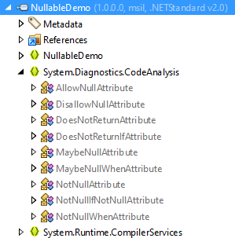

# Nullable [](https://www.nuget.org/packages/Nullable)

_Use .NET Core 3.0's new nullable attributes in older target frameworks._

[:running: Quickstart](#quickstart) &nbsp; | &nbsp; [:books: Guides](https://github.com/manuelroemer/Nullable/wiki) &nbsp; | &nbsp; [:package: NuGet](https://www.nuget.org/packages/nullable)

<hr/>


With the release of C# 8.0, support for [nullable reference types](https://docs.microsoft.com/en-us/dotnet/csharp/tutorials/nullable-reference-types)
has been added to the language.
Futhermore, .NET Core 3.0 added [new nullable attributes](https://docs.microsoft.com/en-us/dotnet/api/system.diagnostics.codeanalysis?view=netcore-3.0)
like the [`AllowNullAttribute`](https://docs.microsoft.com/en-us/dotnet/api/system.diagnostics.codeanalysis.allownullattribute?view=netcore-3.0)
which are sometimes required to exactly declare when and how `null` is allowed in specific code
sections.

Unfortunately, these attributes are not available in older target frameworks like .NET Standard 2.0
which makes annotating existing code harder.
Luckily, this problem can be solved by re-declaring the attributes as `internal class`es - the C#
compiler will still use them for generating warnings, even though the target framework doesn't
support these attributes by itself.

This repository hosts the code for the ["Nullable" NuGet Package](https://www.nuget.org/packages/Nullable)
which, when referenced, adds support for these attributes.

The code for these attributes is added **at compile time** and gets **built into the referencing project**.
This means that the resulting project **does not have an explicit dependency** on the `Nullable`
package, because the attributes are not distributed as a library.

Futhermore, the code only gets added to the project if the nullable attributes are not already
supported by the target framework.
The images below show an example - in the library which targets .NET Standard 2.0, the attributes
have been added during the compilation.
That is not the case for the library targeting .NET Standard 2.1, because the attributes are
available through the .NET BCL there.
This allows you to easily **multi-target** your projects without having to change a single line of
code.

| .NET Standard 2.0 | .NET Standard 2.1 |
| ----------------- | ----------------- |
|  |  |


## Compatibility

Nullabe is currently compatible with the following target frameworks:

* .NET Standard >= 1.0
* .NET Framework >= 2.0

Please have a look at the [guides](https://github.com/manuelroemer/Nullable/wiki) for additional information on how to
install the package for your target framework.


## Quickstart

> :warning: **Important:** <br/>
> You **must** use a C# version >= 8.0 with the `Nullable` package - otherwise, your project won't compile.

The steps below assume that you are using the **new SDK `.csproj`** style.
Please find installation guides and notes for other project types (for example `packages.config`)
[here](https://github.com/manuelroemer/Nullable/wiki).

1. **Reference the package** <br/>
   Add the package to your project, for example via:

   ```sh
   Install-Package Nullable

   --or--

   dotnet add package Nullable
   ```
2. **Ensure that the package has been added as a development dependency** <br/>
   Open your `.csproj` file and ensure that the new package reference looks similar to this:

   ```xml
   <PackageReference Include="Nullable" Version="<YOUR_VERSION>">
     <PrivateAssets>all</PrivateAssets>
     <IncludeAssets>runtime; build; native; contentfiles; analyzers; buildtransitive</IncludeAssets>
   </PackageReference>

   <!-- This style also works, but is not automatically used by .NET: -->
   <PackageReference Include="Nullable" Version="<YOUR_VERSION>" PrivateAssets="all" />
   ```

   This is especially important for libraries that are published to NuGet, because without this,
   the library will have an **explicit dependency** on the `Nullable` package.
3. **Build the project** <br/>
   Ensure that the project compiles. If a build error occurs, you will most likely have to update
   the C# language version.

Afterwards, you can immediately start using the attributes.


## Compiler Constants

The [included C# file](https://github.com/manuelroemer/Nullable/blob/master/src/Nullable.ExcludeFromCodeCoverage/NullableAttributes.cs)
makes use of some compiler constants that can be used to enable or disable certain features.

### `NULLABLE_ATTRIBUTES_DISABLE`

If the `NULLABLE_ATTRIBUTES_DISABLE` constant is defined, the attributes are excluded from the build.
This can be used to conditionally exclude the attributes from the build if they are not required.

In most cases, this should not be required, because the package automatically excludes the attributes
from target frameworks that already support these attributes.


### `NULLABLE_ATTRIBUTES_INCLUDE_IN_CODE_COVERAGE`

Because the attributes are added as source code, they could appear in code coverage reports.
By default, this is disabled via the [`ExcludeFromCodeCoverage`](https://docs.microsoft.com/en-us/dotnet/api/system.diagnostics.codeanalysis.excludefromcodecoverageattribute?view=netcore-3.0)
and [`DebuggerNonUserCode`](https://docs.microsoft.com/en-us/dotnet/api/system.diagnostics.debuggernonusercodeattribute?view=netcore-3.0)
attributes.

By defining the `NULLABLE_ATTRIBUTES_INCLUDE_IN_CODE_COVERAGE` constant, the [`ExcludeFromCodeCoverage`](https://docs.microsoft.com/en-us/dotnet/api/system.diagnostics.codeanalysis.excludefromcodecoverageattribute?view=netcore-3.0)
and [`DebuggerNonUserCode`](https://docs.microsoft.com/en-us/dotnet/api/system.diagnostics.debuggernonusercodeattribute?view=netcore-3.0)
attributes are not applied and the nullable attributes may therefore appear in code coverage reports.


## Building

Because the package consists of source files, building works differently than a normal .NET project.
In essence, no build has to be made at all. Instead, the `*.cs` files are renamed to `*.cs.pp`
(because otherwise, Visual Studio's solution explorer would display the files in a project which
references the package) and then packaged into a NuGet package via a `.nuspec` file.

The solution contains a `_build` project which automatically performs these tasks though. You can then
find the resulting NuGet package file in the `artifacts` folder.


## Contributing

I don't expect this package to require many changes, but if something is not working for you or
if you think that the source file should change, feel free to create an issue or Pull Request.
I will be happy to discuss and potentially integrate your ideas!


## License

See the [LICENSE](./LICENSE) file for details.
